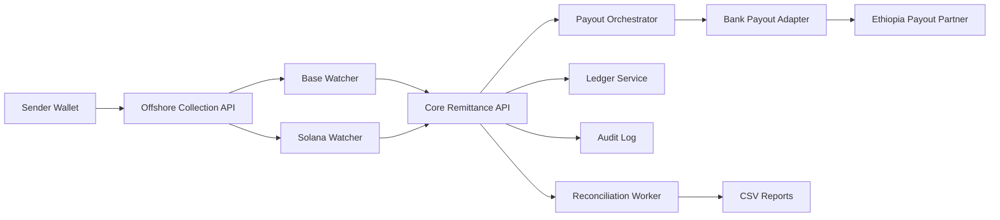

# CryptoPay MVP Architecture

## 1. Architecture Goals
- Preserve legal boundary: offshore crypto operations, Ethiopia fiat operations.
- Deliver end-to-end non-custodial transfer lifecycle with auditability.
- Keep MVP implementation incremental with clear interfaces.
- Build reliability baseline on day 1: idempotency, retry, reconciliation.

## 2. System Context

## 3. Service Boundaries and Responsibilities

### 3.1 Offshore Collection API (Node.js/TypeScript)
- Owns quote creation and transfer initialization metadata.
- Allocates unique deposit route per transfer (chain + token + unique address/memo strategy).
- Stores expected funding details and quote expiry.
- Does not hold sender keys; sender self-signs transactions in their wallet.

### 3.2 Chain Watchers (Go)
- Separate workers for Base and Solana.
- Consume chain events and confirm transfer funding based on configured confirmation rules.
- Emit normalized `FundingConfirmed` events to core API/outbox.
- Handle reorg/race safety via confirmation depth and finality checks.

### 3.3 Core Remittance API (Node.js/TypeScript)
- Owns transfer state machine and business rules.
- Enforces KYC prerequisites and USD 2,000 cap.
- Receives watcher confirmations and triggers payout orchestration.
- Writes double-entry ledger postings and audit logs.
- Publishes domain events through DB outbox.

### 3.4 Payout Orchestrator (Node.js/TypeScript)
- Adapts transfer intent into payout partner requests.
- Calls payout adapter interface with retry and idempotency controls.
- Tracks payout status lifecycle and terminal outcomes.
- Bank transfer adapter is the only supported v1 payout path.

### 3.5 Reconciliation Worker (Node.js/TypeScript)
- Periodically compares transfer records, on-chain confirmations, ledger entries, and payout status.
- Flags mismatches/stuck transfers.
- Outputs CSV report for operations/compliance.

## 4. Trust Boundaries

### 4.1 Boundary A: External User-Controlled Wallets
- Untrusted origin for funding transactions.
- Validate against expected amount/token/chain/deposit route.
- Never trust sender-submitted transaction metadata without chain confirmation.

### 4.2 Boundary B: Offshore Crypto Zone
- Contains chain watchers and collection logic.
- Allowed to use chain RPC providers and crypto libraries.
- Isolated credentials and network policy from Ethiopia services.

### 4.3 Boundary C: Ethiopia Fiat and Compliance Zone
- Contains KYC, transfer orchestration, payout coordination, ledger, audit, reconciliation.
- Must not import crypto SDKs or use on-chain RPC endpoints.
- Handles only fiat-facing and compliance-required records.

### 4.4 Boundary D: Third-Party Integrations
- KYC provider.
- Ethiopia payout partner.
- FX/settlement providers (offshore).
- All interactions require signed requests, timeouts, retries, and response validation.

## 5. Threat Model (MVP)
| Threat | Risk | Control |
|---|---|---|
| Duplicate API calls/webhook replays | Double transfer/payout | Idempotency keys + unique DB constraints + deterministic replay response |
| Chain reorg or false-positive funding | Premature payout | Confirmation threshold + finality checks + delayed trigger window |
| Forged payout callback | Incorrect status transition | Signed callbacks, source allowlist, request verification |
| Partner outage/timeouts | Stuck transfers, SLA breach | Bounded retry with backoff+jitter, manual-review queue |
| Insider misuse/admin override abuse | Unauthorized state change | Append-only audit log + actor attribution + reason codes |
| PII over-collection | Compliance/privacy risk | Minimal data model, field-level encryption, retention policy |
| Secret leakage in logs | Credential compromise | Secret redaction middleware + no secret logging policy |

## 6. Idempotency Strategy
- Scope: all mutating HTTP endpoints, payout requests, watcher event handlers, and callbacks.
- Key shape: `scope:entity_id:client_or_provider_key`.
- Persistence table (`idempotency_record`) stores:
  - key
  - request_hash
  - first_response_status
  - first_response_body
  - created_at
  - expires_at
- Behavior:
  - same key + same hash => return original response.
  - same key + different hash => reject as conflict.
  - duplicate watcher/callback events resolve to no-op with traceable audit log entry.

## 7. Retry Policy
- Use exponential backoff with jitter for retryable external failures.
- Default profile for partner calls:
  - max attempts: 5
  - base delay: 500ms
  - max delay: 10s
  - timeout per request: 5s
- Retryable classes:
  - network errors
  - 408/429/5xx responses
  - temporary provider unavailability
- Non-retryable classes:
  - 4xx validation/auth errors (except 408/429)
  - business rule rejections
- Terminal failures transition transfer to `PAYOUT_REVIEW_REQUIRED` and create audit event.

## 8. Reconciliation Model
- Cadence:
  - near-real-time sweep every 5 minutes for active transfers
  - full daily reconciliation run for prior day settlement
- Data compared:
  - transfer state machine status
  - watcher-confirmed funding records
  - ledger debit/credit balance integrity
  - payout partner terminal status
- Outputs:
  - `reconciliation_run` record
  - `reconciliation_issue` rows
  - CSV report file for ops/compliance
- Minimum CSV columns:
  - transfer_id
  - quote_id
  - chain
  - token
  - funded_amount_usd
  - expected_etb
  - payout_status
  - ledger_balanced
  - issue_code
  - detected_at

## 9. Integration Strategy: MVP Mocked vs Real
| Integration | MVP Mode | Notes |
|---|---|---|
| Base RPC | Real in non-local; mock emitter in local tests | Watcher logic must support both deterministic fixtures and live RPC |
| Solana RPC | Real in non-local; mock emitter in local tests | Same as Base |
| KYC provider | Mock adapter first, real adapter behind env switch | Store only status + reference + timestamps |
| Bank payout partner | Mock sandbox adapter first, real adapter when credentials available | Interface stable from day 1 |
| FX/settlement provider | Mock in MVP | Offshore finance flow represented as integration boundary |

## 10. Data and Privacy Constraints
- Receiver National ID must be stored as tokenized/encrypted value, not plain text where avoidable.
- Keep only required KYC fields and verification metadata.
- Avoid storing raw files unless legally required.
- Apply retention and access control policy per data class.

## 11. State Machine (High-Level)
1. `QUOTE_CREATED`
2. `TRANSFER_CREATED`
3. `AWAITING_FUNDING`
4. `FUNDING_CONFIRMED`
5. `PAYOUT_INITIATED`
6. `PAYOUT_COMPLETED` or `PAYOUT_FAILED`
7. `PAYOUT_REVIEW_REQUIRED` (manual handling path)

All transitions must emit:
- audit log entry
- domain outbox event
- timestamped transition history record

## 12. Non-Goals for MVP
- Advanced fraud engine.
- Multi-provider routing optimization.
- Real-time recipient notifications across multiple channels.
- Custodial wallet or balance product.
