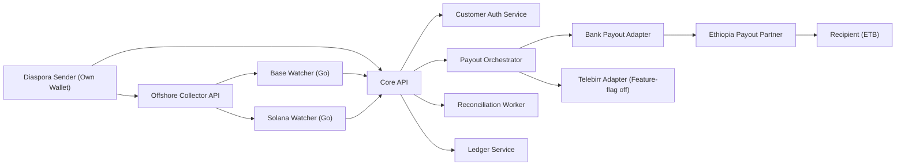
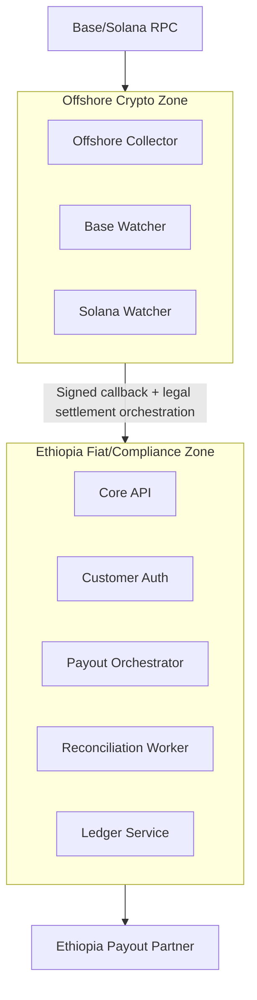
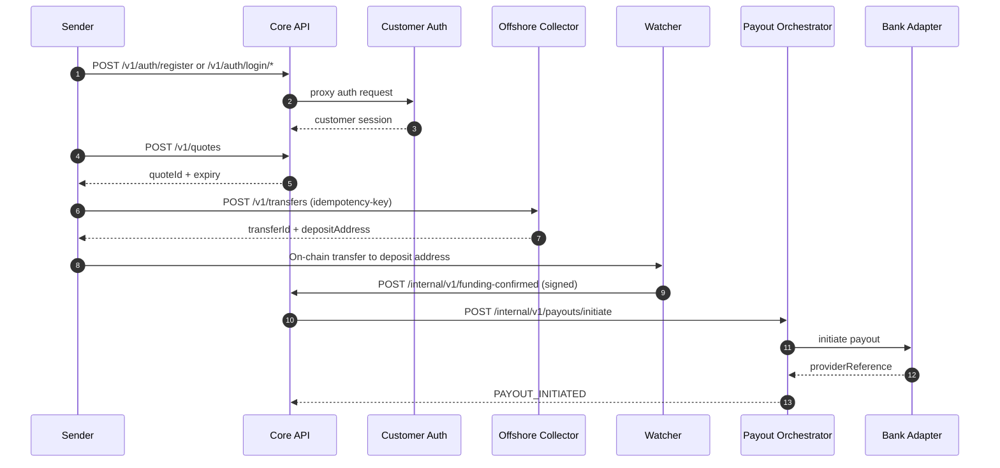
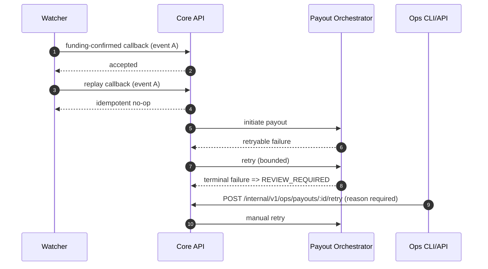
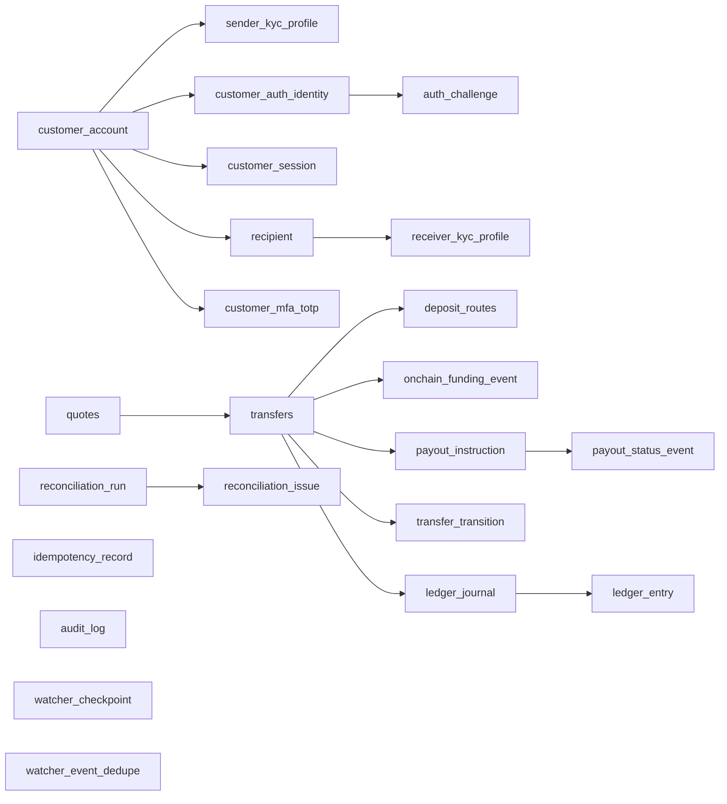

# CryptoPay System Design (Fast Launch)

Customer login/auth is handled by the dedicated `customer-auth` service and exposed to clients through `core-api` public routes.

## 1) System Context

The sender funds with their own wallet (non-custodial). Watchers confirm funding and notify core API via signed callbacks. Ethiopia-side payout remains fiat-only through partner rails.

## 2) Service Responsibility Map
- `core-api`: quote lifecycle, funding confirmation intake, transfer ops API gateway, audit and SLA views.
- `customer-auth`: customer registration/login, session rotation, OTP/magic-link challenges, optional TOTP MFA.
- `offshore-collector`: transfer creation and unique deposit route assignment; enforces transfer preconditions.
- `payout-orchestrator`: payout initiation state machine with retry policy and adapter routing.
- `reconciliation-worker`: detects state mismatches, writes reconciliation issues, and outputs CSV reports.
- `ledger-service`: double-entry journal/entry write path and balance integrity checks.
- `base-watcher`: scans Base chain events, confirms by depth, dedupes, and calls signed funding callback.
- `solana-watcher`: scans Solana finalized signatures/transactions, dedupes, and calls signed funding callback.

Each service has a narrow ownership boundary to keep coupling low and deployment/testing straightforward.

## 3) Trust Boundaries

Crypto operations stay offshore. Ethiopia-side services are explicitly crypto-free and handle KYC state, payout orchestration, audit, and reconciliation only.

## 4) Happy-path Sequence

Funding confirmation time starts SLA tracking. The target is payout initiation within 10 minutes of on-chain confirmation.

## 5) Failure-path Sequence

Duplicate funding callbacks are safely deduplicated. Exhausted payout retries transition to manual review with audited operator actions.

## 6) Data Model Snapshot

Core integrity tables are transfer-centric with immutable transitions and audit history. Watcher checkpoint/dedupe tables guarantee safe resume and replay protection. `receiver_kyc_profile` stores minimal KYC state with encrypted/hash National ID fields.

## 7) Key Reliability Controls
- Idempotency on mutation endpoints and watcher callbacks.
- Bounded retry with jitter for payout provider failures.
- Reconciliation run + issue ledger for mismatch detection.
- Append-only audit logging for sensitive state changes.
- Signed callback verification with replay window.

These controls provide operational safety without adding dashboard complexity at this stage.
